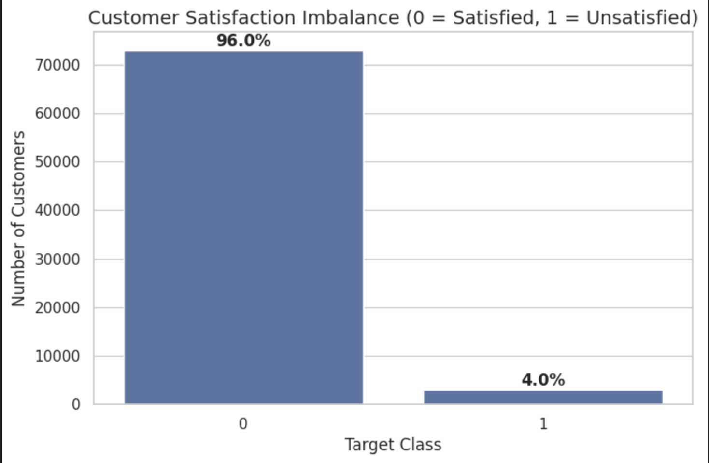
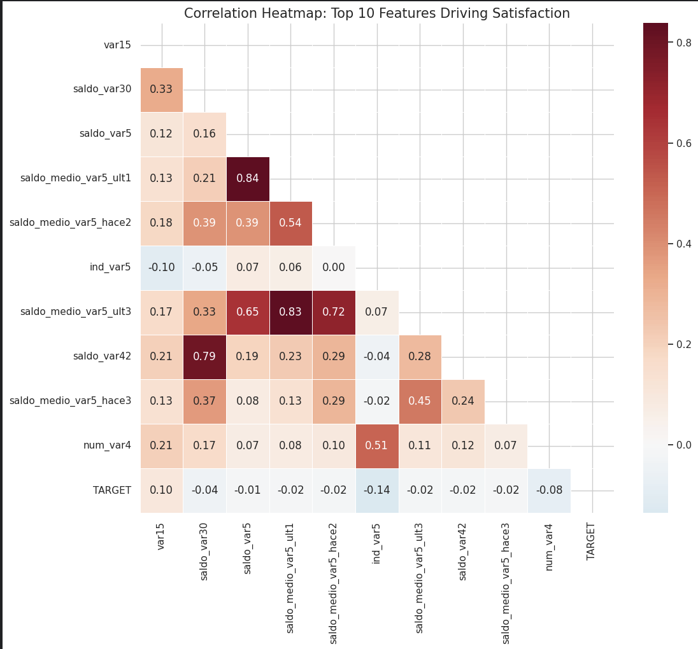
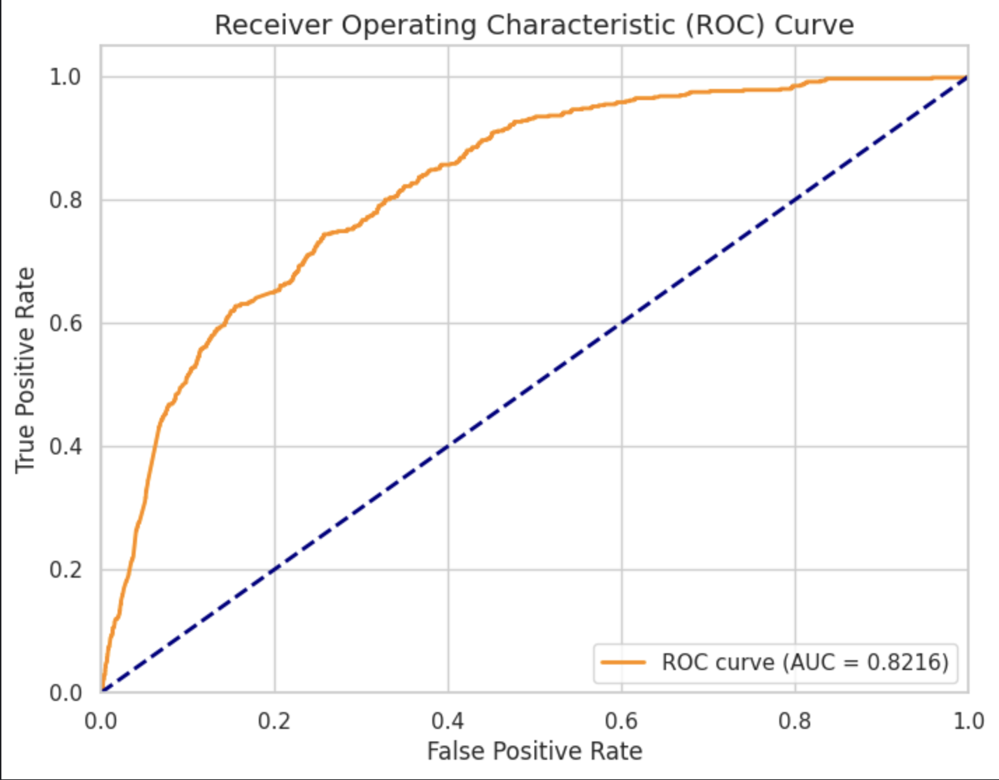
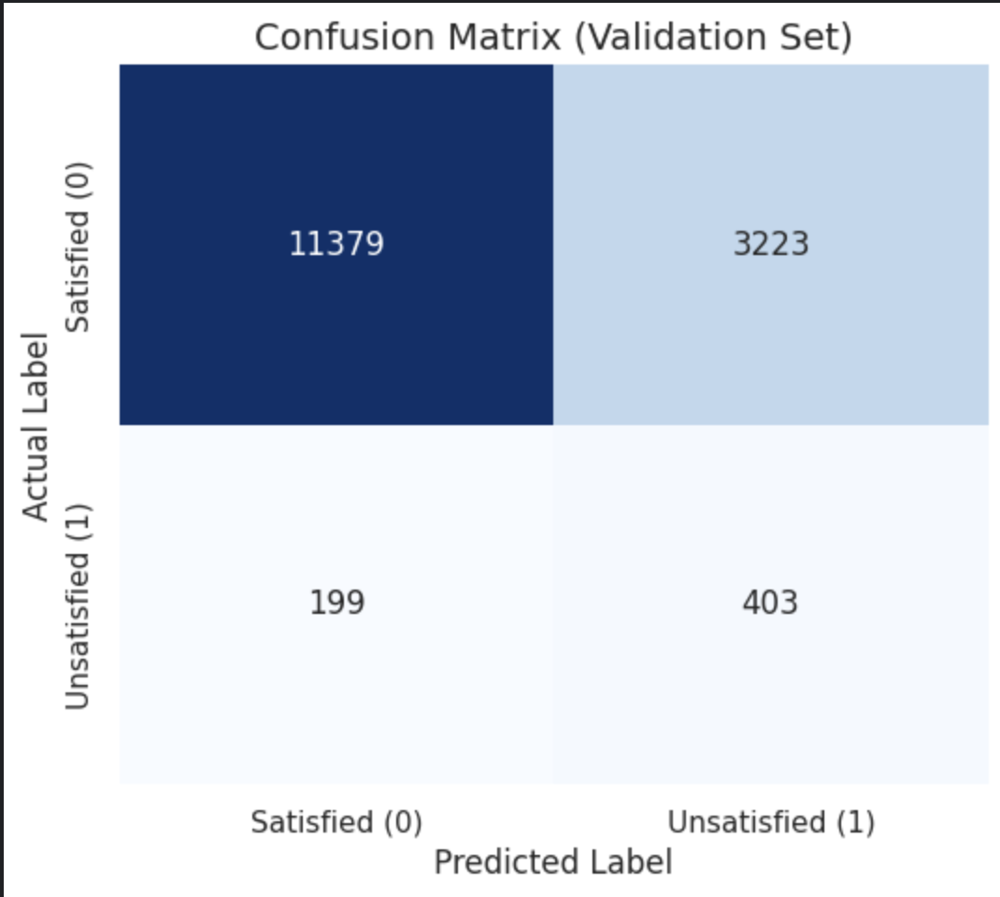

# Santander Customer Satisfaction Prediction

**By Subham Kalwar**

* **One Sentence Summary:** An applied machine learning pipeline predicting customer dissatisfaction on a highly imbalanced dataset using a tuned, class-weighted Random Forest architecture. 

## Overview

This repository contains a machine learning pipeline developed to predict early customer dissatisfaction for the Santander Bank Kaggle challenge. The primary obstacle in this dataset is an extreme target imbalance: out of 75,000+ training records, only 4% represent dissatisfied customers. Because a naive model could achieve 96% accuracy simply by guessing "satisfied" every time, the problem was formulated as a binary classification task evaluated strictly on the AUC-ROC metric. My approach focused on variance filtering to remove uninformative features, followed by the deployment of a Random Forest Classifier. To counteract the 96:4 imbalance and prevent the trees from overfitting, I implemented algorithmic class weighting (`class_weight='balanced'`) alongside strict depth pruning. The final tuned model successfully isolated the minority class, achieving a local Validation AUC of 0.8216 and a Kaggle Public Leaderboard score of 0.79119.

## Summary of Work Done

### Data

* **Type:** * Input: CSV file containing integer and float features (anonymized, e.g., `var15`, `var38`).
  * Output: Binary target column (`TARGET`), where `1` indicates an unsatisfied customer and `0` indicates a satisfied customer.
* **Size:** * Training Data: ~76,020 instances with ~370 features.
  * Testing Data: ~75,818 instances.
* **Instances (Train/Validation Split):** An 80/20 train/validation split was utilized. Crucially, a `stratify` parameter was applied to ensure the validation set maintained the exact 96:4 imbalance ratio present in the training data.

#### Preprocessing / Clean up

* **Variance Filtering:** Scanned the dataset for constant features (Standard Deviation = 0) and dropped them, reducing dimensionality and training overhead.
* **Deduplication:** Dropped identical rows to prevent the model from overfitting on repeated data points.
* **Imputation:** Handled missing/null values internally within the modeling pipeline. 

#### Data Visualization

* **Target Imbalance Chart:** A visual breakdown of the raw dataset demonstrating the extreme 96:4 ratio between satisfied and unsatisfied customers, justifying the departure from standard Accuracy as an evaluation metric.
  
  

* **Targeted Correlation Heatmap:** A masked triangular heatmap isolating the top 10 most important features. This checked for multicollinearity while avoiding the visual noise of plotting all 370+ variables.
  
  

### Problem Formulation

* **Input / Output:** Input is a vector of preprocessed numerical features for a single customer. Output is a continuous probability from `0.0` to `1.0` representing the likelihood of dissatisfaction.
* **Model:** **Random Forest Classifier** selected for its robust handling of non-linear tabular data and its resistance to single-tree overfitting through ensemble voting. 
* **Hyperparameters:**
  * `n_estimators=500`: Increased tree count for a more stable, averaged prediction.
  * `max_depth=15`: Pruned the trees to prevent them from memorizing the training data.
  * `min_samples_split=10`: Forced broader generalizations at the leaf nodes.
  * `class_weight='balanced'`: Automatically adjusted weights inversely proportional to class frequencies to combat the 96% majority class.

### Training

* **Hardware & Environment:** Trained primarily on Kaggle's cloud environment utilizing Python 3, `pandas`, `numpy`, and `scikit-learn`.
* **Process:** Training was accelerated utilizing all available CPU cores (`n_jobs=-1`). The primary difficulty encountered was the model defaulting to predicting `0` for almost all rows due to the imbalance. This was resolved by implementing the `class_weight` parameter and evaluating via `.predict_proba()` rather than absolute `.predict()` classes.

### Performance Comparison

* **Key Performance Metric:** AUC-ROC (Area Under the Receiver Operating Characteristic Curve).
* **Visual Diagnostics:**
  * **ROC Curve:** Plotted the True Positive Rate vs. False Positive Rate across probability thresholds, visually mapping the model's 0.8216 Validation AUC against a 50/50 random-guess baseline.
    
    

  * **Confusion Matrix:** Generated a threshold-adjusted heatmap to break down the exact distribution of True Positives, True Negatives, False Positives, and False Negatives, identifying the model's specific classification behaviors on the validation set.
    
    

* **Results:**
  * Training Split AUC: ~0.90+
  * Stratified Validation AUC: 0.8216
  * Final Kaggle Public Leaderboard AUC: 0.79119

### Conclusions

* A standard Random Forest can successfully navigate highly imbalanced datasets if depth is strictly controlled and minority classes are mathematically weighted. The ~3% gap between validation and test scores indicates minimal overfitting and a healthy, generalized model.

### Future Work

* **Algorithm Shift:** Transition the baseline model to Gradient Boosting frameworks like XGBoost or LightGBM, which historically dominate this specific dataset.
* **Feature Engineering:** Conduct deeper bivariate analysis to combine existing anonymized variables into more highly correlated composite features.

## How to reproduce results

### Overview of files in repository

* `santander_rf_model.ipynb`: The primary Jupyter Notebook containing the end-to-end pipeline. Includes EDA, data cleaning, model training, validation scoring, and final CSV generation.
* `submission.csv`: The final output file containing the test IDs and predicted probabilities, formatted for Kaggle scoring.
* `README.md`: Project documentation and methodology summary.
* `figures/`: Directory containing exported visualizations utilized in this report.

### Software Setup
* Standard Data Science Python stack required:
  * `pandas`
  * `numpy`
  * `scikit-learn`
  * `matplotlib` / `seaborn` (for visualization)

### Data
* The raw dataset is hosted by Kaggle. You can download `train.csv`, `test.csv`, and `sample_submission.csv` directly from the [Santander Customer Satisfaction competition page](https://www.kaggle.com/c/santander-customer-satisfaction/data).

### Training and Evaluation
* Clone the repository and ensure the Kaggle data files are located in the same directory (or update the file paths in the notebook).
* Run the `santander_rf_model.ipynb` notebook sequentially from top to bottom to clean the data, train the ensemble, evaluate the validation split, and generate a new `submission.csv`.